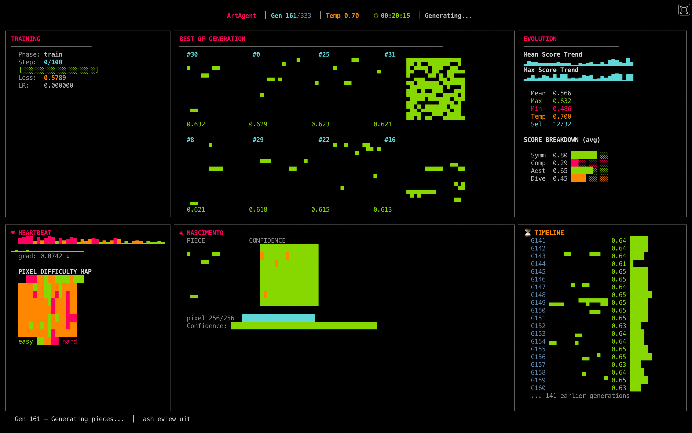

# ArtAgent



An autonomous pixel art evolution system. A small GPT generates 16×16 binary pixel art, an algorithmic critic scores each piece, and a genetic selection loop evolves the model overnight — with a live terminal interface that is itself a work of art.

---

## How it works

```
Bootstrap patterns → train PixelGPT → generate batch → score with critic
                                            ↑                     ↓
                                       finetune              select top-N
                                            ↑                     ↓
                                         repeat ←── save checkpoint
```

1. **PixelGPT** — a decoder-only transformer (~6.4M params) trained to autoregressively generate 16×16 binary pixel art as token sequences
2. **ArtCritic** — pure NumPy scoring across symmetry, complexity, aesthetics, and diversity
3. **GAS loop** — Genetic Art Selection: generate → score → select top-N → finetune → repeat
4. **TUI** — real-time terminal dashboard showing training, gallery, birth of pieces, evolution trends, and generation timeline

---

## TUI layout

```
┌──────────────┬──────────────────────┬───────────────┐
│ TRAINING     │ GALLERY              │ EVOLUTION     │
│ step/loss/lr │ top 8 pieces (4×2)   │ score trends  │
│ progress bar │ with composite score │ mean/max/min  │
├──────────────┼──────────────────────┼───────────────┤
│ HEARTBEAT    │ NASCIMENTO           │ TIMELINE      │
│ grad norms   │ best piece +         │ best per gen  │
│ pixel diff.  │ confidence heatmap   │ score history │
└──────────────┴──────────────────────┴───────────────┘
```

- **Gallery** — top 8 pieces of the current generation rendered as Unicode half-blocks
- **Nascimento** — the best piece side-by-side with its per-pixel confidence map (green = confident, red = uncertain)
- **Heartbeat** — gradient norm waveform and per-pixel difficulty heatmap from the training loss
- **Evolution** — sparkline trends and score breakdown by component
- **Timeline** — archaeological stack of the best piece from every past generation

Press `R` to enter interactive review mode (navigate with arrow keys, mark favorites with Space).

---

## Setup

Requires Python 3.12+ and [uv](https://docs.astral.sh/uv/).

```bash
git clone https://github.com/r4topunk/art-agent
cd art-agent
uv sync
```

---

## Usage

**Run the TUI (recommended)**
```bash
uv run python scripts/tui.py --generations 100
```

**Resume a previous run**
```bash
uv run python scripts/tui.py --generations 100 --resume
```

**Start fresh**
```bash
uv run python scripts/tui.py --generations 100 --no-resume
```

**Standalone scripts**
```bash
uv run python scripts/train.py          # bootstrap training only
uv run python scripts/generate.py       # generate from checkpoint
uv run python scripts/evaluate.py       # score images with critic
uv run python scripts/run_overnight.py --generations 50  # headless loop
```

**Run tests**
```bash
uv run pytest
```

---

## Architecture

| Component | Details |
|-----------|---------|
| Model | Decoder-only GPT, 8 layers, d_model=256, 8 heads, ~6.4M params |
| Vocabulary | 5 tokens: BLACK, WHITE, BOS, EOS, PAD |
| Sequence | 258 tokens (BOS + 256 pixels in raster order + EOS) |
| Training | AdamW, cosine annealing + warmup, batch size 128 |
| Generation | KV-cache autoregressive sampling, runs on CPU |
| Critic | Symmetry + complexity + aesthetics + diversity → composite score |
| Device | MPS (Metal) for training, CPU for generation |

---

## Scoring

Each piece is scored across four dimensions:

| Metric | Measures |
|--------|---------|
| **Symmetry** | Horizontal, vertical, and rotational similarity |
| **Complexity** | Density, edge count (Sobel), block entropy — penalizes both extremes |
| **Aesthetics** | Quadrant balance, clear borders, connected components |
| **Diversity** | Hamming distance bonus vs. other pieces in the batch |

Scores are normalized to [0, 1] and combined into a `composite` used for selection.

---

## Configuration

All hyperparameters live in `art/config.py`:

```python
d_model = 256          # model width
n_layers = 8           # transformer depth
images_per_gen = 32    # pieces generated per evolution step
select_top = 12        # pieces kept for finetuning
finetune_steps = 100   # gradient steps per generation
train_steps = 500      # initial bootstrap training steps
```

---

## Environment

Developed on Apple M4 (16 GB unified memory). MPS acceleration is used automatically when available. Falls back to CPU transparently.

---

## Inspiration

Inspired by [@unstonio](https://x.com/unstonio)'s work on autoresearch agents and PixelGPT.
